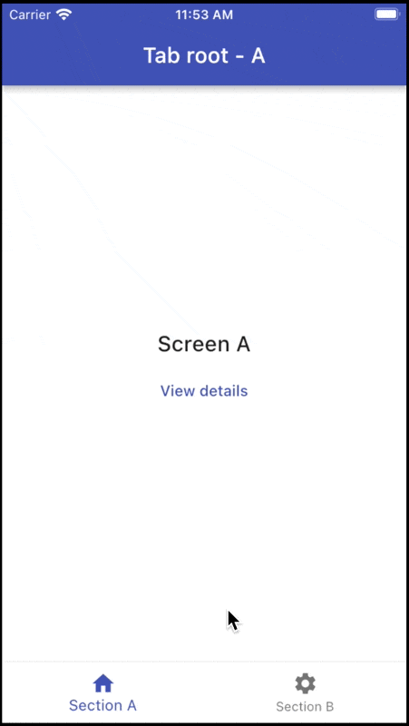

# Stateful Nested Navigation com Beamer

## Notes

A Stateful Navigation Nested é totalmente suportada usando `BeamerDelegates` nested.

Veja este arquivo para mais detalhes:

- [scaffold_with_bottom_nav_bar.dart](lib/src/routing/scaffold_with_bottom_nav_bar.dart)